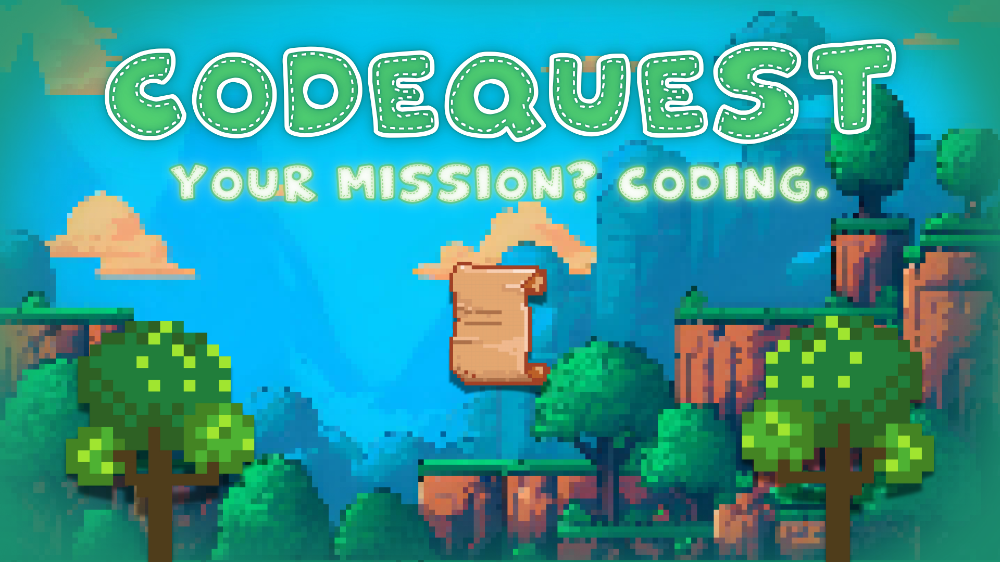

# 🧩 CodeQuest!  
## 📌 Overview  
An individual training series packed with **coding problems and challenges**.  
Participants sharpen their **problem-solving skills** and progress through levels,  
tackling increasingly **complex programming concepts**.  

---

## 🎯 Objectives  
- Strengthen **problem-solving and algorithmic thinking**  
- Provide **progressive challenges** from easy to advanced  
- Reinforce understanding of **programming fundamentals** through practice  
- Prepare participants for **coding competitions and technical interviews**  

---

## 📚 Topics  
- **Beginner Challenges** – Variables, conditionals, loops  
- **Intermediate Challenges** – Arrays, strings, recursion  
- **Advanced Challenges** – Trees, graphs, dynamic programming  
- **Algorithmic Thinking** – Time complexity, optimization techniques  
- **Competitive Coding Prep** – Problem-solving under constraints  

---

## 📋 Event Details  
- **Type of Event:** Training · Series (Individual Participation)  
- **Level:** Beginner → Advanced  
